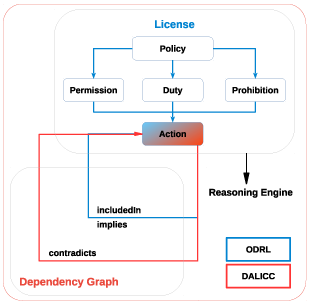

<!-- Output copied to clipboard! -->

<!-- Yay, no errors, warnings, or alerts! -->

<h2>DALICC Vocabulary Documentation</h2>

<h2>Introduction/h2>

DALICC stands for Data License Clearance Center. It is a software framework that supports application developers, legal experts and sales managers in the legally secure reutilization of third party digital sources such as data, content or software. 

As modern IT applications increasingly retrieve, store and process data from a variety of sources, questions about the compatibility of licenses and the application`s compliance with existing law may occur. Issues of rights clearance are especially relevant in the creation of derivative works compiled from multiple data sources. Clearing and negotiating rights issues is a time-consuming, complex and error-prone task. 

The DALICC framework supports the automated clearance of rights, thus helping to detect licensing conflicts and significantly reducing the costs of rights clearance in the creation of derivative works.

<h2>DALICC Information Model</h2>

The DALICC Information Model as depicted in Figure 1 consists of two components. 

The first component makes a reference to the [ODRL information model](https://www.w3.org/TR/odrl-model/) to express permissions, duties and prohibitions stated in a license. It uses vocabularies from ODRL, CCRel and particular extensions to describe licenses for machine processing in a legally valid manner. In this respect a license can be understood as a policy that defines specific actions as permissions, duties or prohibitions. 

The second component is the so-called Dependency Graph. This graph expresses the valid relationships between various actions defined in a license.The graph currently consists of three basic relationships: "included in", "implies" and "contradicts". The graph is used to check the consistency of the license itself and to detect potential conflicts arising from contradicting actions defined in two or more licenses.

<h2>License Vocabulary </h2>

In order to express a license DALICC uses terms from vocabularies provided under the following namespaces:

**CCRel**

@prefix cc: <http://creativecommons.org/ns#> 

**DALICC**

@prefix dalicc: <http://dalicc.net/ns#> 

@prefix dalicclib: <http://dalicc.net/licenselibrary/> 

**Dublin Core**

@prefix dcmitype: <http://purl.org/dc/dcmitype/> 

@prefix dct: <http://purl.org/dc/terms/> 

**FOAF**

@prefix foaf: <http://xmlns.com/foaf/0.1/> 

**ODRL**

@prefix odrl: <http://www.w3.org/ns/odrl/2/> 

**opensource.org**

@prefix osl: <http://opensource.org/licenses/> 

**Schema.org**

@prefix scho: <http://schema.org/> 

<h3>CCRel - Creative Commons Rights Expression Language</h3>

@prefix cc: <http://creativecommons.org/ns#> 

<table>
  <tr>
   <td>Term
   </td>
   <td>Description
   </td>
   <td>Reference
   </td>
  </tr>
  <tr>
   <td>cc:attributionName
   </td>
   <td>the name to cite when giving attribution when the work is modified or redistributed under the terms of the associated Creative Commons license
   </td>
   <td><a href="http://creativecommons.org/ns#attributionName">http://creativecommons.org/ns#attributionName</a> 
   </td>
  </tr>
  <tr>
   <td>cc:CommercialUse 
   </td>
   <td>using the Work for commercial purposes
   </td>
   <td><a href="http://creativecommons.org/ns#CommercialUse">http://creativecommons.org/ns#CommercialUse</a> 
   </td>
  </tr>
  <tr>
   <td>cc:DerivativeWorks 
   </td>
   <td>preparing derivatives of the work
   </td>
   <td><a href="http://creativecommons.org/ns#DerivativeWorks">http://creativecommons.org/ns#DerivativeWorks</a> 
   </td>
  </tr>
  <tr>
   <td>cc:jurisdiction
   </td>
   <td>associates the license with a particular legal jurisdiction
   </td>
   <td><a href="http://creativecommons.org/ns#jurisdiction">http://creativecommons.org/ns#jurisdiction</a> 
   </td>
  </tr>
  <tr>
   <td>cc:legalcode
   </td>
   <td>references the corresponding legal text of the license
   </td>
   <td><a href="http://creativecommons.org/ns#legalcode">http://creativecommons.org/ns#legalcode</a> 
   </td>
  </tr>
  <tr>
   <td>cc:Notice 
   </td>
   <td>providing an indication of the license that governs the work
   </td>
   <td><a href="http://creativecommons.org/ns#Notice">http://creativecommons.org/ns#Notice</a> 
   </td>
  </tr>
  <tr>
   <td>cc:ShareAlike 
   </td>
   <td>when redistributing derivative works of this work, using the same license
   </td>
   <td><a href="http://creativecommons.org/ns#ShareAlike">http://creativecommons.org/ns#ShareAlike</a> 
   </td>
  </tr>
  <tr>
   <td>cc:SourceCode 
   </td>
   <td>when redistributing this work (which is expected to be software when this requirement is used), source code must be provided
   </td>
   <td><a href="http://creativecommons.org/ns#SourceCode">http://creativecommons.org/ns#SourceCode</a> 
   </td>
  </tr>
</table>

* For more information [https://wiki.creativecommons.org/CC_REL](https://wiki.creativecommons.org/CC_REL) 

<h3>DALICC</h3>

@prefix dalicc: <http://dalicc.net/ns#> 

@prefix dalicclib: <http://dalicc.net/licenselibrary/> 

<table>
  <tr>
   <td>Term
   </td>
   <td>Description
   </td>
  </tr>
  <tr>
   <td>
 dalicc:addStatement 

   </td>
   <td>The Assignee may add his own copyright statement, notices to his modifications and may provide additional or different license terms and conditions for use, reproduction, or distribution of his modifications, or for any such Derivative Works as a whole, provided use, reproduction, and distribution of the Work otherwise complies with the conditions stated in this License.
   </td>
  </tr>
  <tr>
   <td>
 dalicc:attachoffer 

   </td>
   <td>The Assignee may add a written offer for permissions according to the license.
   </td>
  </tr>
  <tr>
   <td>
 dalicc:attributionNotice 

   </td>
   <td>Notify the attributes of License Material.
   </td>
  </tr>
  <tr>
   <td>
 dalicc:chargeDistributionFee 

   </td>
   <td>The distribution of the Licensed Material is provided on a costly basis.
   </td>
  </tr>
  <tr>
   <td>
 dalicc:chargeLicenseFee 

   </td>
   <td>The Licensed Material is available for use at monetary cost.
   </td>
  </tr>
  <tr>
   <td>
 dalicc:chargeOffer 

   </td>
   <td>The Assignee may charge a fee for the physical act of transferring a copy, and you may at your option offer warranty protection in exchange for a fee.
   </td>
  </tr>
  <tr>
   <td>
 dalicc:contradicts 

   </td>
   <td>An Action contradicts with another Action.
   </td>
  </tr>
  <tr>
   <td>
 dalicc:CreativeWork 

   </td>
   <td>This asset type comprises any type of literary work that is subject to copyright. It also includes multimedia work that combines various media types such as text, audio, images, animations, video and interactive content.
   </td>
  </tr>
  <tr>
   <td>
 dalicc:irrevocable 

   </td>
   <td>The license cannot be terminated for any reason or only that the license cannot be terminated for convenience, but still may be terminated for breach.
   </td>
  </tr>
  <tr>
   <td>
 dalicc:modificationNotice 

   </td>
   <td>A notice that indicates if the Assignee modified the Licensed Material and retains an indication of any previous modifications.
   </td>
  </tr>
  <tr>
   <td>
 dalicc:noWarrantyNotice 

   </td>
   <td>Informs that Licensed Material does not provide any warranties.
   </td>
  </tr>
  <tr>
   <td>
 dalicc:patentFree 

   </td>
   <td>The license applies only to those patent claims licensable by such Contributor that are necessarily infringed by their Contribution(s) alone or by combination of their Contribution(s) with the Licensed Material to which such Contribution(s) was submitted.
   </td>
  </tr>
  <tr>
   <td>
 dalicc:patentNotice 

   </td>
   <td>Notifies that Licensed Material is patented or includes patented parts.
   </td>
  </tr>
  <tr>
   <td>
 dalicc:perpetual 

   </td>
   <td>A perpetual license allows to use the licensed work indefinitely.
   </td>
  </tr>
  <tr>
   <td>
 dalicc:permissionNotice 

   </td>
   <td>The permission notices which are in the License shall be included.
   </td>
  </tr>
  <tr>
   <td>
 dalicc:publish 

   </td>
   <td>The Assigner permits the Assignee to prepare and issue (a book, journal) for public sale to make it generally known, to make available online.
   </td>
  </tr>
  <tr>
   <td>
 dalicc:promote 

   </td>
   <td>The Assigner permits the Assignee to use the licensed work for promotional purposes..
   </td>
  </tr>
  <tr>
   <td>
 dalicc:redistribute 

   </td>
   <td>The Assigner permits/prohibits the Assignees to redistribute the Asset.
   </td>
  </tr>
  <tr>
   <td>
 dalicc:royalityFree 

   </td>
   <td>Refers to the right to use copyright material or intellectual property without the need to pay royalties or license fees for each use, per each copy or volume sold or some time period of use or sales.
   </td>
  </tr>
  <tr>
   <td>
 dalicc:sellCopy 

   </td>
   <td>The Assignee may sell the copies of the License Material.
   </td>
  </tr>
  <tr>
   <td>
 dalicc:sublicense 

   </td>
   <td>The license granted by a licensee to a third party, under the authority of the license originally granted by a licensor to the licensee.
   </td>
  </tr>
  <tr>
   <td>
 dalicc:trademarkNotice 

   </td>
   <td>Informs that Licensed Material is a trademark or includes trademark. The license does not grant permission to use the trade names, trademarks, service marks, or product names of the Licensor, except as required for reasonable and customary use in describing the origin of the Work and reproducing the content of the notice file.
   </td>
  </tr>
  <tr>
   <td>
 dalicc:worldwide 

   </td>
   <td>The license terms are valid throughout the world.
   </td>
  </tr>
</table>

<h3>Dublin Core</h3>

@prefix dcmitype: <http://purl.org/dc/dcmitype/> .

<table>
  <tr>
   <td>Term
   </td>
   <td>Description
   </td>
   <td>Reference
   </td>
  </tr>
  <tr>
   <td>dcmitype:Dataset
   </td>
   <td>Data encoded in a defined structure.
   </td>
   <td><a href="http://purl.org/dc/dcmitype/Dataset">http://purl.org/dc/dcmitype/Dataset</a> 
   </td>
  </tr>
  <tr>
   <td>dcmitype:Software
   </td>
   <td>A computer program in source or compiled form.
   </td>
   <td><a href="http://purl.org/dc/dcmitype/Software">http://purl.org/dc/dcmitype/Software</a> 
   </td>
  </tr>
</table>

@prefix dct: <http://purl.org/dc/terms/> .

<table>
  <tr>
   <td>Term
   </td>
   <td>Description
   </td>
   <td>Reference
   </td>
  </tr>
  <tr>
   <td>dct:alternative 
   </td>
   <td>An alternative name for the resource.
   </td>
   <td><a href="http://purl.org/dc/terms/alternative">http://purl.org/dc/terms/alternative</a> 
   </td>
  </tr>
  <tr>
   <td>dct:publisher 
   </td>
   <td>An entity responsible for making the resource available.
   </td>
   <td><a href="http://purl.org/dc/terms/publisher">http://purl.org/dc/terms/publisher</a> 
   </td>
  </tr>
  <tr>
   <td>dct:source 
   </td>
   <td>A related resource from which the described resource is derived.
   </td>
   <td><a href="http://purl.org/dc/elements/1.1/source">http://purl.org/dc/elements/1.1/source</a> 
   </td>
  </tr>
  <tr>
   <td>dct:title
   </td>
   <td>A name given to the resource.
   </td>
   <td><a href="http://purl.org/dc/elements/1.1/title">http://purl.org/dc/elements/1.1/title</a> 
   </td>
  </tr>
</table>

<h3>ODRL - Open Digital Rights Language</h3>

@prefix odrl: <http://www.w3.org/ns/odrl/2/> 

<table>
  <tr>
   <td>Term
   </td>
   <td>Description
   </td>
   <td>Reference
   </td>
  </tr>
  <tr>
   <td>odrl:assigner 
   </td>
   <td>The Party is the issuer of the Rule.
   </td>
   <td><a href="http://www.w3.org/ns/odrl/2/assigner">http://www.w3.org/ns/odrl/2/assigne</a>r
   </td>
  </tr>
  <tr>
   <td>odrl:AssetCollection 
   </td>
   <td>An Asset that is collection of individual resources
   </td>
   <td><a href="http://www.w3.org/ns/odrl/2/AssetCollection">http://www.w3.org/ns/odrl/2/AssetCollection</a> 
   </td>
  </tr>
  <tr>
   <td>odrl:derive 
   </td>
   <td>To create a new derivative Asset from this Asset and to edit or modify the derivative.
   </td>
   <td><a href="http://www.w3.org/ns/odrl/2/derive">http://www.w3.org/ns/odrl/2/derive</a>
   </td>
  </tr>
  <tr>
   <td>odrl:display
   </td>
   <td>To create a static and transient rendition of an Asset.
   </td>
   <td><a href="http://www.w3.org/ns/odrl/2/display">http://www.w3.org/ns/odrl/2/display</a>
   </td>
  </tr>
  <tr>
   <td>odrl:distribute
   </td>
   <td>To supply the Asset to third-parties.
   </td>
   <td><a href="http://www.w3.org/ns/odrl/2/distribute">http://www.w3.org/ns/odrl/2/distribute</a>
   </td>
  </tr>
  <tr>
   <td>odrl:grantUse
   </td>
   <td>To grant the use of the Asset to third parties.
   </td>
   <td><a href="http://www.w3.org/ns/odrl/2/grantUse">http://www.w3.org/ns/odrl/2/grantUse</a>
   </td>
  </tr>
  <tr>
   <td>odrl:implies
   </td>
   <td>An Action asserts that another Action is not prohibited to enable its operational semantics.
   </td>
   <td><a href="http://www.w3.org/ns/odrl/2/implies">http://www.w3.org/ns/odrl/2/implies</a>
   </td>
  </tr>
  <tr>
   <td>odrl:includedin
   </td>
   <td>An Action transitively asserts that another Action that encompasses its operational semantics.
   </td>
   <td><a href="http://www.w3.org/ns/odrl/2/includedIn">http://www.w3.org/ns/odrl/2/includedIn</a>
   </td>
  </tr>
  <tr>
   <td>odrl:modify
   </td>
   <td>To change existing content of the Asset. A new asset is not created by this action.
   </td>
   <td><a href="http://www.w3.org/ns/odrl/2/modify">http://www.w3.org/ns/odrl/2/modify</a>
   </td>
  </tr>
  <tr>
   <td>odrl:present 
   </td>
   <td>To publicly perform the Asset.
   </td>
   <td><a href="http://www.w3.org/ns/odrl/2/present">http://www.w3.org/ns/odrl/2/present</a>
   </td>
  </tr>
  <tr>
   <td>odrl:reproduce 
   </td>
   <td>To make duplicate copies of the Asset in any material form.
   </td>
   <td><a href="http://www.w3.org/ns/odrl/2/reproduce">http://www.w3.org/ns/odrl/2/reproduce</a>
   </td>
  </tr>
  <tr>
   <td>odrl:Set
   </td>
   <td>A Policy that expresses a Rule over an Asset.
   </td>
   <td><a href="http://www.w3.org/ns/odrl/2/Set">http://www.w3.org/ns/odrl/2/Set</a>
   </td>
  </tr>
  <tr>
   <td>odrl:target 
   </td>
   <td>The target property indicates the Asset that is the primary subject to which the Rule action directly applies.
   </td>
   <td><a href="http://www.w3.org/ns/odrl/2/target">http://www.w3.org/ns/odrl/2/target</a>
   </td>
  </tr>
</table>

